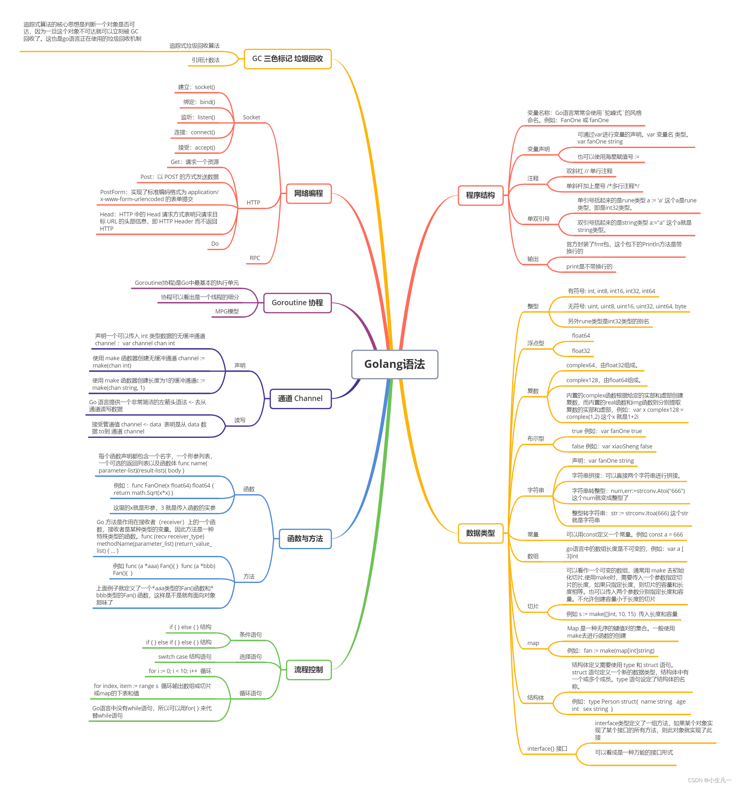
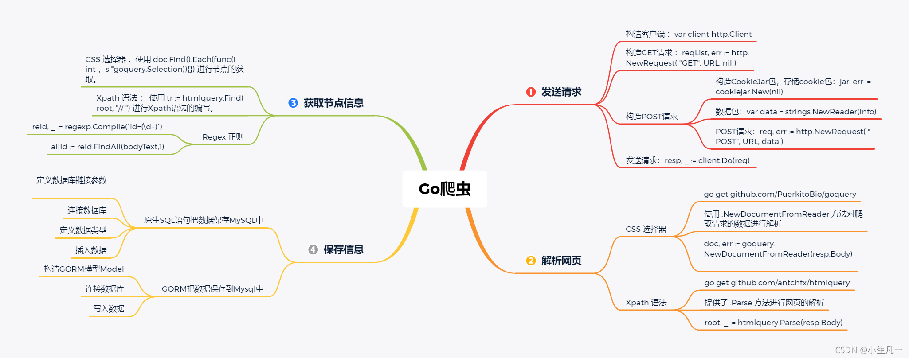

# 推荐资料

这里只列举综合性较强的站点、博客、个人主页

go语言高级编程：https://github.com/chai2010/advanced-go-programming-book

halfrost - LeetCode-go：https://github.com/halfrost/LeetCode-Go

Go语言入门60题：https://blog.csdn.net/weixin_45304503/category_11294773.html

极客兔兔手撕框架：https://geektutu.com/post/gee.html

深入架构原理与实践：https://www.thebyte.com.cn/

腾讯技术工程：https://www.zhihu.com/org/teng-xun-ji-zhu-gong-cheng

csdiy - wiki: https://csdiy.wiki/

Bilibili 小生凡一：https://space.bilibili.com/291348098

## 语法学习思维导图

## 爬虫思维导图

